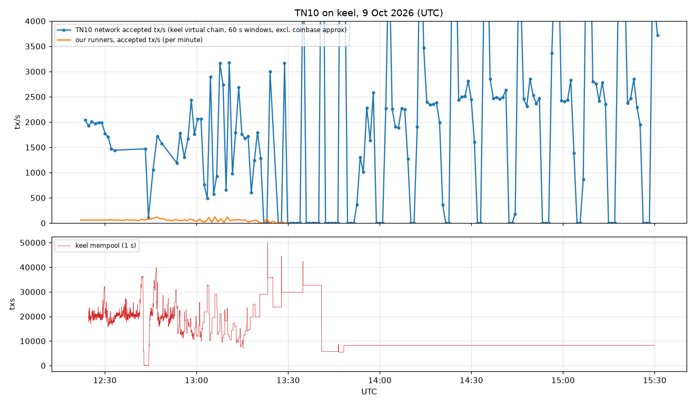
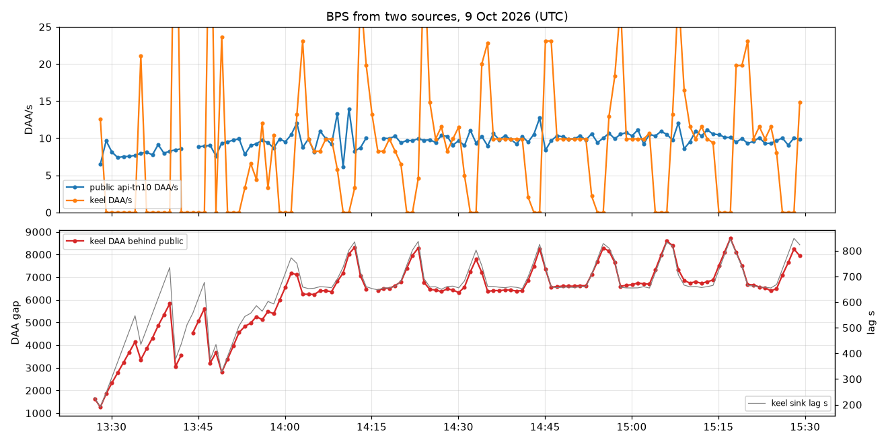

> **Experimental. We are just trying this.** See [DISCLAIMER](../../DISCLAIMER.md).

Wording, Kaspa Pulse (@gokugalax), 7 Oct 2026: sign-and-send processes are senders; runner is the setup; bot is reserved for the operator.

# TN10 monitoring, 9 Oct 2026 (keel pre-test day)

**Status: final, compiled after the 15:30Z end.**

All times UTC. Every clock time in this repo is UTC.

This folder is the **bot's** monitor. The box measured keel through the tunnel. Submit, accept, mempool, lag, and miner share here are the bot's. A combined row in this folder is the bot alone. It is not Build's rate, and it is not the two-side score.

Build's monitor is the desk, on locus. Those rates are not in this folder. The 8 Oct desk sheet is [tonight-8-oct/RESULTS.md](https://github.com/STP-KAS/grok-bot-build-combo/blob/main/tonight-8-oct/RESULTS.md). The lines both sides fill on the next run are [MONITOR.md](../../plan/MONITOR.md) and [NEXT-RUN-MONITOR.md](../../plan/NEXT-RUN-MONITOR.md). The section [Build's view, checked](#builds-view-checked) is the bot answering a Build claim. It is not Build's sheet.

No txids, keys, seeds or wallet files are in this folder. The mining address named here is the public Grok Bot address `kaspatest:qzffl5…` (see [NEXT-RUN-MONITOR](../../plan/NEXT-RUN-MONITOR.md)).

## Key to the labels

- **Claim (measured on TN10)**: we measured it today; the data file is named next to it.
- **Not sure / open for debate**: our reading of the data; other readings are possible.
- **Needs more testing**: one short sample, or a confound we could not remove.

## What ran

| UTC | What |
|---|---|
| 09:37–09:59 | Run 1 (`keel`): ramp 1→6 runners, 20→240 tx/s. Ended when both free Pinggy tunnels expired (09:59). |
| 10:33–10:53 | Run 2 (`keel2`): 6 runners at 120 then 60 tx/s. Ended on the keel lag rule (keel stalled from 10:45, mempool 121k). |
| 11:03–11:07 | Run 3 (`keel3`): 1 runner at 20/10 tx/s on the new paid runner tunnel. Ended on a ~25 s tunnel blip. |
| 11:08–12:40 | Run 4 (`keel4`): 6 then 15 runners, new break rule; held 60 tx/s from 11:40. |
| 12:40–13:30 | Run 5 (`keel5`, same 15 runners adopted): C ramp 60→100, B fee windows (fixed 200/300 vs live quote), A miners 4→1→4. Ended 13:29:59 on the keel lag rule (lag 302 s). |
| 12:24–15:30 | This monitor (box): keel mempool 1 s, node/fee/lag 10 s, network TPS 60 s, block redundancy 5 min, indexer 30 s + visibility 1 min, BPS two sources 60 s (from 13:27), 10-minute status block, box clock start/end. |

All bot transactions today were the light lane hop: 1 input, 1 output, P2SH `OP_TRUE` (anyone-can-spend), mass 643, fee tiers 200/300 sompi/gram (1× / 1.5×) unless a window says `quote`. Runners and miners used the keel tunnel only; n0 did not run.

## Ramp tables, all keel runs today

Source: `data/steps-auto-logged.csv` (written by the ramp controller at each step end). Accept % is accepted/submitted over the step; above 100% means late accepts from the step before landed in this one.

| run | step | UTC | runners | target tx/s | submitted/s | accepted/s | accept % | keel mempool peak | lag max s | new rule: eventual % / p50 s / p90 s | old rule (60 s) % | note |
|---|---|---|---|---|---|---|---|---|---|---|---|---|
| keel | R1x20 | 09:37:54–09:40:59 | 1 | 20 | 20 | 20 | 100.1 | 59 | 0.8 | — | — |  |
| keel | R2x20 | 09:40:59–09:43:59 | 2 | 40 | 40 | 40.2 | 100.5 | 74 | 0.8 | — | — |  |
| keel | R3x20 | 09:43:59–09:48:59 | 3 | 60 | 60 | 61.7 | 102.7 | 3,185 | 2.7 | — | — |  |
| keel | R6x20 | 09:48:59–09:54:01 | 6 | 120 | 120 | 120.6 | 100.5 | 26,158 | 14 | — | — |  |
| keel | R6x40 | 09:54:01–09:56:08 | 6 | 240 | 240 | 224.4 | 93.5 | 29,628 | 7.2 | — | — | LIMIT: node/network-bound(accept behind) |
| keel | R6x20-HOLD | 09:56:08–09:59:22 | 6 | 120 | 111.3 | 111.8 | 100.5 | 36,628 | 2.2 | — | — | terminal: all runners exited on their own (see sender-*.out) |
| keel2 | R6x20 | 10:33:42–10:35:46 | 6 | 120 | 120 | 113.3 | 94.4 | 40,307 | 11.3 | — | — | LIMIT: node/network-bound(accept behind) |
| keel2 | R1x10-HOLD | 10:35:46–10:40:46 | 6 | 60 | 60 | 59.8 | 99.8 | 32,106 | 11.9 | — | — | confirm 5 min |
| keel2 | R1x10-HOLD2 | 10:40:46–10:53:15 | 6 | 60 | 41.8 | 30.5 | 72.9 | 121,039 | 315.7 | — | — | terminal: keel lag 304.4s > 300 |
| keel3 | R1x20 | 11:03:15–11:05:39 | 1 | 20 | 20 | 19.3 | 96.5 | 16,354 | 7.9 | — | — | LIMIT: node/network-bound(accept behind) |
| keel3 | R1x10-HOLD | 11:05:39–11:07:41 | 1 | 10 | 8.4 | 8.3 | 98.6 | 24,121 | 7 | — | — | terminal: all runners exited on their own (see sender-*.out) |
| keel4 | R6x10 | 11:08:48–11:10:51 | 6 | 60 | 62.9 | 32.5 | 51.7 | 20,778 | 34.6 | 85.71 / 28.8 / inf | 33.8 | LIMIT: node/network-bound(late/missing accepts) |
| keel4 | R6x5-HOLD | 11:10:51–11:15:55 | 6 | 30 | 30 | 32.2 | 107.2 | 24,353 | 58.3 | 100 / 1.05 / 2.21 | — | confirm 5 min |
| keel4 | R15x2-HOLD | 11:23:04–11:28:06 | 15 | 30 | 30 | 30 | 99.9 | 27,123 | 6.1 | 100 / 1.24 / 2.25 | — | confirm 5 min |
| keel4 | R15x4 | 11:34:51–11:37:56 | 15 | 60 | 60.2 | 53.6 | 88.9 | 36,361 | 16.4 | 100 / 3.39 / 8.66 | 80.4 |  |
| keel4 | R15x8 | 11:37:56–11:39:57 | 15 | 120 | 120.2 | 162.9 | 135.5 | 43,331 | 41.9 | 100 / 8.08 / 16.71 | 70.4 | LIMIT: node/network-bound(late/missing accepts) |
| keel4 | R15x4-HOLD | 11:39:57–11:45:00 | 15 | 60 | 59.8 | 64 | 107.1 | 25,455 | 19.8 | 100 / 1.92 / 7.13 | — | confirm 5 min |

Run 4's R15x4-HOLD kept going at 60 tx/s after 11:45 until run 5 adopted the same runners at 12:40 (per-minute rates in `data/bot-per-minute.csv`).

Run 5 windows (`data/run5-windows.csv`; bot rates from the per-second sender logs, bot blocks/s from the miner logs):

| window | UTC | target tx/s | fees | miners | bot submitted/s | bot accepted/s | keel mempool max | lag max s | bot blocks/s | keel DAA/s |
|---|---|---|---|---|---|---|---|---|---|---|
| C-base-60 | 12:40:26–12:44:30 | 60 | fixed | 4 | 60.1 | 60.5 | 36,251 | 20.0 | 4.2 | 10.83 |
| C-100 | 12:44:30–12:48:38 | 100 | fixed | 4 | 100.0 | 99.1 | 39,842 | 31.4 | 3.82 | 10.1 |
| B-fixed-1 | 12:49:23–12:59:26 | 60 | fixed | 4 | 60.0 | 58.9 | 30,787 | 37.6 | 2.87 | 9.21 |
| B-quote-1 | 12:59:26–13:09:28 | 60 | quote | 4 | 60.1 | 57.9 | 32,852 | 90.3 | 1.16 | 7.67 |
| A-miners1 | 13:09:28–13:19:31 | 60 | fixed | 1 | 60.0 | 58.8 | 24,997 | 93.0 | 0.3 | 7.13 |
| A-miners4-back | 13:19:31–13:20:32 | 60 | fixed | 4 | — | — | 19,818 | 125.6 | 0.0 | — |
| A-miners4-back-half | 13:20:32–13:20:38 | 30 | fixed | 4 | — | — | 19,818 | 125.6 | 0.0 | — |
| A-miners4-back-half-half | 13:20:38–13:29:31 | 15 | fixed | 4 | 15.0 | 19.2 | 49,914 | 277.6 | 0.15 | 4.99 |
| B-quote-2 | 13:29:31–13:29:59 | 15 | quote | 4 | — | — | 29,802 | 307.7 | 0.0 | — |

C-100 evaluation: 18,915 of 18,915 accepted eventually, p50 6.2 s, p90 23.4 s, so 100 tx/s failed the p90 ≤ 10 s rule and the controller went back to 60.

## Run 5 and the light-tx trial (from the load worker's LIMIT-REPORT, copied at compile time; hosts removed)

#### Run 5 (9 Oct, 12:40-13:30Z), written by the monitor worker from ramp5.out and summary5.json
Same 15 runners adopted from run 4 (light lane hops, P2SH OP_TRUE, mass 643), 4 miners tagged "stp grok bot". Windows (eventual = share of the window's txs accepted by keel by the end of the run; p50/p90 = submit to keel accept):

| window | UTC | target tx/s | fees | miners | n | eventual % | p50 s | p90 s | mempool peak | lag max s | result |
|---|---|---|---|---|---|---|---|---|---|---|---|
| C-base-60 | 12:40:26-12:44:30 | 60 | 200/300 | 4 | 11,020 | 100 | 1.2 | 15.9 | 43,437 | 20.4 | baseline clean (eventual 100%) |
| C-100 | 12:44:30-12:48:38 | 100 | 200/300 | 4 | 18,915 | 100 | 6.2 | 23.4 | 37,483 | 24.4 | not clean (p90 > 10 s), back to 60 |
| B-fixed-1 | 12:49:23-12:59:26 | 60 | 200/300 | 4 | 32,598 | 100 | 13.7 | 29.8 | 30,787 | 35.3 | all accepted, slower than C-base |
| B-quote-1 | 12:59:26-13:09:28 | 60 | quote 183/275 | 4 | 32,527 | 97.6 | 45.3 | 85.7 | 32,638 | 93.9 | keel lag rising; confounded with fee change |
| A-miners1 | 13:09:28-13:19:31 | 60 | 200/300 | 1 | 32,605 | 88.4 | 37.1 | not reached | 25,668 | 95.6 | keel lag rising |
| A-miners4-back | 13:19:31-13:20:38 | 60 then 30 | 200/300 | 4 | 40 | 0 | - | - | 19,818 | 128.8 | lag > 120 s: halved twice |
| A-miners4-back-half-half | 13:20:38-13:29:31 | 15 | 200/300 | 4 | 7,109 | 41.7 | not reached | not reached | 35,742 | 274.6 | keel falling behind |
| B-quote-2 | 13:29:31-13:29:59 | 15 | quote 192/288 | 4 | 0 | - | - | - | 29,802 | 302.2 | terminal |

Terminal 13:29:59Z: keel lag 302.2 s > 300. The controller stopped all runners and miners (13:31:49Z: runners 0, miners 0). The feeder was stopped 14:01Z (keel synced=false).
Reading: C-base-60 clean, C-100 eventual 100% but p90 23 s, so back to 60. The B (fixed vs quote) and A (miners 4 -> 1 -> 4) windows ran while keel's own lag climbed from ~35 s to 300 s, so they do not isolate the fee or miner effect. After the stop the bot sent nothing, and keel kept falling behind the public node (lag 656 s, 6,502 DAA behind at 14:17Z), so the lag was not caused by our load.

#### Light-tx probe (13:47Z, runs/keel5-*/light5-probe.json)
Route: P2SH with redeem script OP_TRUE (0x51), sigScript = push(redeem). One fund tx (mass 1,701) and 3 chained unsigned 1-in/1-out hops (mass 637 each, 0 sig ops, 0 signature bytes): all four "accepted into keel mempool", i.e. standard-valid on kaspad 2.1.0. Whether they were mined and accepted on chain was not checked.
Capacity in theory: 500,000 / 637 = ~785 tx per block, ~7,850 tx/s at 10 BPS, against ~308 / ~3,080 for a signed 1-in/1-out (~1,624 mass). Anyone-can-spend hops are not realistic payments.

#### Light-lane scaled trial
Never started. light5-wait.sh polled keel lag every 20 s from ~13:50Z; keel never got below 60 s lag before the 15:10Z cutoff (light5-wait.log, 15:10:13Z: "keel never recovered below 60 s lag before 15:10Z; light lane not started"). No light-lane rates exist for today.

Labels for the light-tx lines: the probe (four txs standard-valid in keel's mempool, masses 1,701 / 637) is **Claim (measured on TN10)**; on-chain acceptance of those four was not checked. The ~785 tx/block and ~7,850 tx/s figures are **Not sure / open for debate** (theory from mass only). Anyone-can-spend hops measure capacity, not realistic signed payments.

## Limit findings

- **Claim (measured on TN10)**: morning (run 1), the first soft break was 240 tx/s (6 runners): 93.2% accepted inside the 60 s window, 100% accepted eventually (30,345/30,345), p50 2.0 s, p90 5.0 s. Keel's mempool was 26–30k, almost all outside traffic.
- **Claim (measured on TN10)**: from 10:30 the clean level dropped. 120 tx/s broke in run 2 (94.4% in window) and run 4 (p90 16.7 s at 11:38–11:39), 100 tx/s broke in run 5 (p90 23.4 s). 60 tx/s held with 100% eventual accept whenever keel itself kept up. Outside mempool was 20–40k during those steps.
- **Claim (measured on TN10)**: keel stalled three times while it was the only node we read: 10:45 (virtual stopped, mempool 121k, miners got `route is full`), 13:20–13:30 (lag rose to 302 s, run 5 stopped), and from about 13:40 (no blocks seen in the 5-minute block windows, mempool frozen at 8,211, lag 868.3 s at 15:28:26).
- **Claim (measured on TN10)**: tunnel drops: both free tunnels expired at 09:59 (Pinggy 60-minute cap); a ~25 s blip on the paid runner tunnel at 11:07. No paid-tunnel drop after that.
- **Claim (measured on TN10)**: keel's lag after 13:30 is not caused by our load. Run 5 stopped at 13:29:59 (controller killed runners and miners); the bot sent nothing afterwards, yet keel kept falling behind: at 14:17 sink lag 656 s and 6,502 DAA behind the public node, while the public node ran ~10 DAA/s. Gap at the last sample: 7,940 DAA.
- **Not sure / open for debate**: the likely cause is desk overload, with locus, keel, Build's senders and the desk miners on one PC. We cannot see the desk's CPU, RAM or disk from the box.
- **Not sure / open for debate**: the falling clean level (240 → 120 → 60) tracks keel's own health and the outside mempool, not our side: runner CPU stayed under 10%, 99.6–100% of target was submitted, rejects were 0 outside tunnel events. keel shares one desk PC with locus, Build's senders and the desk miners.
- **Needs more testing**: 240 tx/s held only 2 minutes; no step above 120 ran with keel healthy and outside load low at the same time.

Old rule versus new rule: stp raised the runner cap to 15 in chat; at 11:08 the break rule changed from "≥95% accepted inside a 60 s window" to "≥99% accepted eventually and p90 ≤ 10 s", because the old rule fired even at 20 tx/s under this outside load (run 3). Both are logged per step (`old_rule_min60_pct` column).

## Confirmation time, 1× against 1.5× (run 4)

Source: `data/confirm-time-by-tier-keel4.csv`. Submit start to keel accept, per transaction, own logs.

| step | tier | n | p50 s | p95 s | p99 s | worst s | % > 30 s | % > 60 s |
|---|---|---|---|---|---|---|---|---|
| A-miners1 | 1.5x | 18109 | 35.45 | 134.73 | 258.7 | 267.2 | 59.41 | 25.29 |
| A-miners1 | 1x | 18106 | 36.0 | 135.91 | 259.32 | 266.9 | 60.32 | 25.67 |
| A-miners4-back | 1.5x | 1801 | 209.2 | 236.2 | 239.12 | 241.3 | 100.0 | 100.0 |
| A-miners4-back | 1x | 1803 | 209.31 | 236.36 | 239.05 | 241.4 | 100.0 | 100.0 |
| A-miners4-back-half | 1.5x | 98 | 176.63 | 180.07 | 181.68 | 181.7 | 100.0 | 100.0 |
| A-miners4-back-half | 1x | 98 | 176.22 | 180.05 | 181.43 | 181.4 | 100.0 | 100.0 |
| A-miners4-back-half-half | 1.5x | 1927 | 221.96 | 279.92 | 287.05 | 291.6 | 100.0 | 100.0 |
| A-miners4-back-half-half | 1x | 1930 | 222.55 | 280.26 | 287.16 | 292.3 | 100.0 | 100.0 |
| ALL | 1.5x | 226773 | 4.3 | 69.29 | 221.57 | 291.6 | 15.09 | 6.03 |
| ALL | 1x | 226801 | 4.9 | 69.93 | 222.05 | 292.3 | 15.4 | 6.11 |
| B-fixed-1 | 1.5x | 18111 | 12.13 | 32.61 | 37.21 | 40.5 | 8.68 | 0.0 |
| B-fixed-1 | 1x | 18123 | 12.76 | 33.2 | 37.79 | 43.9 | 9.63 | 0.0 |
| B-quote-1 | 1.5x | 18048 | 41.96 | 88.6 | 98.49 | 103.6 | 65.26 | 28.68 |
| B-quote-1 | 1x | 18058 | 42.56 | 89.21 | 99.05 | 106.0 | 66.02 | 29.2 |
| C-100 | 1.5x | 14623 | 3.1 | 25.16 | 31.65 | 35.3 | 1.57 | 0.0 |
| C-100 | 1x | 14612 | 4.02 | 25.8 | 32.13 | 38.5 | 1.83 | 0.0 |
| C-base-60 | 1.5x | 7320 | 1.99 | 21.03 | 29.52 | 32.0 | 0.83 | 0.0 |
| C-base-60 | 1x | 7319 | 2.29 | 21.43 | 29.52 | 32.8 | 0.82 | 0.0 |
| HOLD | 1.5x | 130422 | 2.18 | 21.34 | 37.92 | 53.0 | 2.32 | 0.0 |
| HOLD | 1x | 130427 | 2.74 | 21.77 | 38.3 | 58.8 | 2.39 | 0.0 |
| R15x4 | 1.5x | 5422 | 2.31 | 38.75 | 46.1 | 48.5 | 6.79 | 0.0 |
| R15x4 | 1x | 5436 | 2.83 | 39.74 | 46.94 | 52.3 | 7.36 | 0.0 |
| R15x8 | 1.5x | 7293 | 12.64 | 35.58 | 38.11 | 39.9 | 14.18 | 0.0 |
| R15x8 | 1x | 7289 | 13.01 | 35.82 | 38.67 | 41.7 | 14.71 | 0.0 |
| R6x10 | 1.5x | 3599 | 24.12 | 56.63 | 61.76 | 63.3 | 43.51 | 2.45 |
| R6x10 | 1x | 3600 | 24.84 | 57.04 | 62.22 | 63.8 | 44.31 | 2.83 |

- **Claim (measured on TN10)**: 1.5× (300) was faster than 1× (200) by about 0.5 s at p50 in every step, and the tails were nearly the same. 1.5× did not buy inclusion while 1× waited: both tiers landed (never-seen at log end: 1× 2376, 1.5× 2385, mostly in flight at the run 5 stop).
- **Needs more testing**: no step had keel healthy and the mempool above the quote buckets long enough to separate the tiers.

## Network TPS and our share

Source: `data/network-tps-1m.csv` (60 s windows, transactions accepted by keel's virtual chain, coinbase approximately removed), 165 samples 12:23–15:30. Chart: `tps-chart.png`.

- **Claim (measured on TN10)**: while keel kept up (lag ≤ 30 s in the window, 17 samples, 12:24–13:15): average **1,627.0 tx/s**, median 1,703.8, min 105.9 (12:43–12:44, when keel's mempool emptied for a minute), max 2,435.4.
- **Claim (measured on TN10)**: our runners averaged 54.0 accepted tx/s in the sampled minutes, about 4.5% of the network total.
- Samples with keel behind are kept in the file but flagged by `keel_lag_max_s_in_window`; they are catch-up artifacts (all-sample max 10,069.6 tx/s, min 0.0). Do not quote them as network rates.

## Block redundancy (stp asked 12:28Z)

Method: every 5 minutes, 60 s of keel `block-added` notifications (full blocks) against the transactions keel's virtual chain accepted. `tx slots` = non-coinbase transactions summed over all blocks received; `unique` = distinct ids among them; duplicate share = 1 − unique/slots. From 12:52 each block is also colored chain / blue / red from the chain blocks' mergesets. Files: `data/block-redundancy-5m.csv` (all windows), `data/block-redundancy-v2-5m.csv` (colored). Only windows where keel had accepted ≥95% of the window's unique ids by the read are valid; the rest are keel lag, not network data.

| window UTC | blocks/s | avg tx/block | max tx/block | tx slots/s | unique in blocks/s | duplicate share | unique accepted/s | red blocks | ids only in red → accepted | our block share |
|---|---|---|---|---|---|---|---|---|---|---|
| 12:29 (v1) | 11.17 | 338.6 | 435 | 3781.1 | 1964.4 | 48.0% | 1857.5 | — | — | 36.0% |
| 12:55 | 8.58 | 353.5 | 472 | 3034.6 | 1549.4 | 48.9% | 1482.5 | 155/515 | 1076/1076 | 35.3% |
| 13:00 | 6.9 | 316.3 | 479 | 2182.2 | 1853.1 | 15.1% | 1984.6 | 15/414 | 0/0 | 3.9% |
| 13:10 | 6.6 | 317.6 | 691 | 2095.8 | 1828.3 | 12.8% | 2247.1 | 6/396 | 0/0 | 1.8% |

- **Claim (measured on TN10)**: blocks carried about 300–350 transactions each (max seen 691), close to the mass limit for 1-in/1-out transactions. Total tx slots reached 2,100–3,800/s while unique transactions stayed about 1,550–2,000/s. At 12:29 and 12:55, 48–49% of tx slots were duplicates of a transaction already in another block of the same minute.
- **Claim (measured on TN10)**: in the colored windows where keel kept up, 97–100% of the unique ids seen in blocks were already accepted at the read, and every id that appeared only in red blocks was accepted too (1300/1300). Transactions in non-chain blocks were not lost.
- **Not sure / open for debate**: duplicate share was ~48% when our 4 miners made 35–36% of the blocks (12:29, 12:55) and 13–15% when our share was 2–4% (13:00 and 13:10; keel degrading, then 1 miner). That fits "two miner groups building templates from overlapping mempools put the same txs in parallel blocks". Why last week went above 3k/s is open: one hypothesis is less overlap when each sender's own miners mined its own txs first. We did not test that.
- **Needs more testing**: four valid windows only; keel's health and our miner share changed together, so the two causes are confounded.

## Build's view, checked

This is not Build's monitor and not Build's result table. Build's submitted and accepted rates stay on the desk, on locus. The lines below are the bot's check of one Build claim about mass and off-chain blocks.

Build's claim: a signed 1-in/1-out tx is ~1,624 mass; with the 500,000 block mass limit that is ~308 tx/block and ~3,080 tx/s at 10 BPS. Build's 12:23Z window: 3,611 tx/s into blocks, 2,371 accepted. Build attributes the gap to about half the blocks being off the selected chain, so "their txs never joined". Build proposes cutting miners to about 10 blocks/s (desk 12 + bot miners pushed it to 11.5 blocks/s with 5.3/s on the selected chain), paying the live quote, and beyond ~3,500 a lighter tx (1 in / 1 out, no signature, anyone-can-spend, 643 mass, ~778/block, ~7,780 tx/s).

- **Claim (measured on TN10)**: the mass math agrees with what we saw: 300–350 tx per block, max 691 (some blocks carried lighter txs; ours are 643 mass).
- **Claim (measured on TN10)** against the off-chain explanation: in our colored windows, txs in red and blue non-chain blocks were accepted (100% of window ids, all red-only ids accepted). The gap between tx slots and accepted is explained by duplicates (up to 49% of slots), not by off-chain blocks being dropped. In GHOSTDAG a chain block's mergeset (blue and red) has its transactions accepted.
- **Needs more testing**: cutting miners. Difficulty retargets to ~10 BPS anyway, so fewer miners may only remove short-term excess and red blocks. Our A window (4 → 1 bot miner, 13:09–13:19) overlapped keel degrading, so it does not answer this.
- **Not sure / open for debate**: the light tx raises capacity per block, but it measures anyone-can-spend hops, not realistic signed payments. All of today's bot load already used that light shape (643 mass); label any light-tx number that way.

## Mempool, lag, fee

- **Claim (measured on TN10)**: keel mempool, every 1 s (10,788 samples, 2 failed): median 8,211 (skewed: keel's mempool sat frozen at 8,211 from ~13:50 while keel was behind), min 126, peak **49,914** at 13:23:17. File `data/keel-mempool-1s.csv`.
- **Claim (measured on TN10)**: keel sink lag, every 10 s (1106 samples): median 647.7 s, p95 811.0 s, max **868.3 s** at 15:28:26; 800 samples over 60 s; 337 samples with `isSynced=false`. File `data/keel-node-10s.csv`.
- **Claim (measured on TN10)**: fee estimate, normal bucket: 100.0–193.4 sompi/gram, median 188.5; never above 200. Priority bucket max 779.0.

## BPS from two sources (stp asked 13:25Z)

Every 60 s: keel's `virtualDaaScore` and the public `api-tn10.kaspa.org/info/blockdag` `virtualDaaScore`, as DAA/s, plus the DAA gap. File `data/bps-two-sources-60s.csv`, chart `bps-chart.png`. 123 samples.

- **Claim (measured on TN10)**: public node 9.64 DAA/s on average (min 6.17, max 13.97); keel 8.77 DAA/s (min 0, max 54.75, the max is catch-up). Keel was 1,270 to 8,713 DAA behind the public node.
- **Not sure / open for debate**: the network ran near its normal ~10 BPS (public 6.17–13.97 DAA/s in 60 s samples, average 9.64) while keel fell behind, so this afternoon's slowdown reads as **keel behind**, not **network slow**. The public endpoint is behind Cloudflare (`cf-cache-status` logged); a cached reply shortens or lengthens a sample, which is why single samples swing.

- **Claim (measured on TN10)**: from ~14:05 keel's gap follows a sawtooth with a period of about 10 minutes: keel processes 0 DAA/s for 3–5 minutes (gap rises ~6,500 → ~8,500), then catches up at 20+ DAA/s, but never closes to the public node (gap floor ~6,400, lag floor ~650 s).
- **Not sure / open for debate**: a 10-minute rhythm points at something scheduled on the desk (a 10-minute job, sender rounds, or a kaspad periodic task) rather than random overload. We cannot see the desk from the box.

## Indexer (api-tn10.kaspa.org)

- **Claim (measured on TN10)**: `/info/health` every 30 s (358 samples): 338 answers were Cloudflare `STALE`, 18 timed out, 1 was 503. The cached body showed the indexer's last accepted-tx block time at 11:47:13Z for most of the afternoon; the DB blue score moved only once (580,580,059 → 580,635,621).
- **Claim (measured on TN10)**: visibility, one of our accepted ids per minute polled until the indexer showed it: 48/48 became visible, delay min 523.9 s, median 803.7 s, max 1,093.7 s. Ids stay local; `data/indexer-visibility-1m.csv` has times only.
- **Claim (measured on TN10)**: by the plan's rule (3 samples of 503/timeout, or a visibility delay above 300 s) the indexer was **frozen**: every visibility delay was above 300 s. It was slow, not dead: every id did appear.
- **Not sure / open for debate**: at what sustained tx/s it froze cannot be read from today: it was already stale at 11:47, under ~1,500–2,000 tx/s network load.

## Mining share

Files: `data/mining-share-10m.csv` (ours = `Block submitted successfully` lines in our 4 miner logs; total = keel DAA delta), and the user-agent count `stp grok bot` in the block-redundancy windows (direct from the blocks).

| 10 min from | network blocks/s (keel DAA) | bot blocks/s | bot share |
|---|---|---|---|
| 12:20 | 9.97 | 4.16 | 41.7% |
| 12:30 | 10.21 | 4.37 | 42.8% |
| 12:40 | 10.43 | 3.99 | 38.3% |
| 12:50 | 9.17 | 2.75 | 30.0% |
| 13:00 | 7.09 | 1.11 | 15.7% |
| 13:10 | 6.7 | 0.28 | 4.2% |
| 13:20 | 4.88 | 0.13 | 2.7% |
| 13:30 | 2.15 | 0.0 | 0.0% |
| 13:40 | 12.97 | 0.0 | 0.0% |
| 13:50 | 4.08 | 0.0 | 0.0% |
| 14:00 | 9.81 | 0.0 | 0.0% |
| 14:10 | 10.9 | 0.0 | 0.0% |
| 14:20 | 10.57 | 0.0 | 0.0% |
| 14:30 | 9.73 | 0.0 | 0.0% |
| 14:40 | 9.77 | 0.0 | 0.0% |
| 14:50 | 10.12 | 0.0 | 0.0% |
| 15:00 | 10.15 | 0.0 | 0.0% |
| 15:10 | 10.35 | 0.0 | 0.0% |
| 15:20 | 8.71 | 0.0 | 0.0% |

- **Claim (measured on TN10)**: with 4 miners and keel healthy (12:20–12:50) our share was 38–43% by miner logs and 35–36% by user agent in the block windows. It fell to 0–16% after 13:00 as keel fell behind (stale templates) and when run 5 cut to 1 miner (13:09–13:19), then 0 after the 13:30 stop.
- **Not sure / open for debate**: miner-log counts include submitted blocks that may end up red; the user-agent count is the better number. keel DAA undercounts total blocks when keel lags; after 13:27 the public DAA/s (`bps` file) is the better denominator.
- **Needs more testing**: miners-off control at the 2× load. The A window (1 miner) was not matched to the same load with keel healthy.

## Box

- Box clock: UDP NTP is blocked from the box (10/10 timeouts at 12:25). Fallback: HTTP `Date` second-boundary against two public servers, 5 samples each, accuracy about ±RTT/2. Start 12:25: offset −8 to −39 ms (RTT 10–38 ms). End 15:30: offset −81 to +4 ms (RTT 10–64 ms). No move beyond the method's ±RTT/2 accuracy; the 50 ms flag cannot be scored with this method.
- Box disk: 105.6–106.0 GB free on every 10-minute row (`data/status-10m.jsonl`).

## Ten-minute status block

`data/status-10m.jsonl`: one row per 10 minutes with session, runner count, box disk, our submitted/accepted tx/s, network TPS average, keel synced/lag/mempool/fee, latest indexer sample, miner processes and miner blocks. Usage and keel CPU are `not measured` on every row (see below). Combined rate is bot-only on every row because Build's side is not readable from the box.

## Not measured, against the plan's lines

| Plan line | Due (UTC) | Why not measured |
|---|---|---|
| Desk NTP (`w32tm`), 5 samples at start and end | 12:24 and 15:30 | Desk only; the box cannot run it. |
| Locus synced, UTXO index, mempool, fee, free RAM, desk disk | every 10-min row 12:30–15:30 | locus is not reachable from the box. |
| Build submitted/accepted tx/s, combined sums | every row | Build's sender logs are on the desk. Combined = bot only. |
| Usage counters, both sides | every row | No product counter available to this worker. |
| keel CPU, mempool-cap hits | every row / at flattening | keel CPU is on the desk; reject reasons are logged (0 cap hits on our side). |
| Ordered stream (2/s at 1× and 1.5×), reorder and overtake counts | whole run | Not running today. |
| Six public mempool names | every row | Not part of the box tooling today. |
| Miners-off control at the 2× load | 2× step | Not run at matched load; run 5 A window (1 miner) overlapped keel degrading. |
| Mining share per node (locus side) | per step | Desk miners mine on locus; not readable from the box. |
| Confirmation probes ~450 per tier per step | per step | Not a separate probe; per-transaction logs used instead (larger n). |
| Five tx ids per minute | every minute | Saved locally in the runner minute files; not in git by rule. Count only. |
| Rows 14:00–15:30 bot side | 14:00–15:30 | Bot load stopped 13:29:59 (run 5, keel lag rule); keel stayed behind afterwards, so no bot rates after that unless the Run 5 section above shows a light-tx trial. |

The three n0 rows in "What 8 Oct left unread" are closed; n0 did not run.

## Deviations from the plan

- This was the **pre-test**, not the storm. The storm is the evening run in [NEXT-RUN-MONITOR](../../plan/NEXT-RUN-MONITOR.md). There was no B0 and no 2×…30× step schedule; steps were the ramp controller's.
- stp raised the runner cap from 6 to 15 in chat (11:15–11:23). The plan says never eight box runners for the storm; that line still stands for tonight unless stp changes it.
- The break rule changed at 11:08 to eventual ≥ 99% and p90 ≤ 10 s; the old 60 s / 95% rule is logged next to it on every step.
- stp extended the end from 14:00 to 15:30 at 12:37. Loggers restarted at 14:00:56 (about 56 s gap in the 1 s mempool series).
- The light-lane scaled trial never started: keel never got below 60 s lag before its 15:10 cutoff.
- Box NTP used the HTTP Date fallback because UDP 123 is blocked.
- Mining share uses miner logs and block user agents, not a full chain walk with transactions every 10 minutes, to keep keel's RPC light.

## Proposals for tonight's test (9 Oct 21:30Z)

Each line: what to change · why (number) · how to see success · label. Nothing here was tested as a change today.

**Bot (box runners and miners via keel)**

1. Mine where we send: bot miners stay on keel, our runners send only to keel. · Duplicate share was ~48% of tx slots when our miners made ~35% of blocks, 13–15% when they made 0–5%. · Duplicate share per 5 min drops while unique accepted/s holds or rises. · **Not sure / open for debate**.
2. Fee spread: use 200/300/450 instead of 200/300. · 1.5× beat 1× by only ~0.5 s p50 today; overlap with Build's tiers may cause same-tx picks. · p50/p90 per tier separate; duplicate share falls. · **Needs more testing**.
3. Rate cap ~60 tx/s on keel unless outside load drops. · 60 held clean (100% eventual, p90 ≤ 7 s); 100 and 120 broke under 20–40k outside mempool. · No lag-rule stop in the first hour. · **Claim (measured on TN10)** for the level; whether it holds tonight is open.
4. Log per-block tx count and duplicate share every 5 min (this monitor's `redun2.mjs`). · It settled the off-chain question today (red-only ids 100% accepted). · Rows present on every 5-minute mark. · **Claim (measured on TN10)** that it works.
5. Keep the paid tunnel for runner and miner (already in place). · Free tunnels dropped at 60 min (09:59); paid one had one ~25 s blip in 4 h. · Zero tunnel stops. · **Claim (measured on TN10)**.

**Build (locus senders and desk miners)**

1. Desk miners mine on locus, the node Build's senders target. · Same duplicate-share reading as above. · Build's tx slots/s vs unique accepted/s gap narrows. · **Not sure / open for debate**.
2. Keep Build's fee tiers distinct from the bot's (e.g. bot 200/300/450, Build at the live quote). · Same as bot 2. · Same. · **Needs more testing**.
3. Watch desk CPU and RAM every 10 minutes: keel and locus share one PC. · keel stalled at 10:45 (mempool 121k), lagged 302 s at 13:30, then stopped following the network from ~13:40 while the public node kept ~9 DAA/s. · No keel lag over 60 s; CPU/RAM rows filled. · **Not sure / open for debate** that the desk is the cause.
4. Build ramps on locus; bot holds its cap on keel. · keel was the weak point today, not the network. · Locus and keel both stay synced. · **Needs more testing**.

**Both**

- One-side-only control: bot alone (10 min), Build alone (10 min), then combined, at fixed rates. · Today's duplicate share can't be split between sides. · Duplicate share and unique accepted/s per control step. · **Needs more testing**.
- Read BPS from keel and from the public node side by side, so "network slow" and "keel behind" are told apart on every row. · Today keel was 1,270–8,713 DAA behind while the public node ran ~9.64 DAA/s. · Both columns on the row. · **Claim (measured on TN10)** that the method works.

## Files

`data/`: keel-mempool-1s.csv, keel-node-10s.csv, network-tps-1m.csv, bot-per-minute.csv, block-redundancy-5m.csv, block-redundancy-v2-5m.csv, bps-two-sources-60s.csv, indexer-30s.csv, indexer-visibility-1m.csv, mining-share-10m.csv, coinbase-outputs-to-bot-1m.csv (UtxosChanged count, kept for reference; counts outputs, not blocks), steps-auto-logged.csv, run5-windows.csv, confirm-time-by-tier-keel4.csv, status-10m.jsonl, box-clock.jsonl.

---

Kaspa Pulse counts the chain from outside the setup. Comparison comes to us first.
